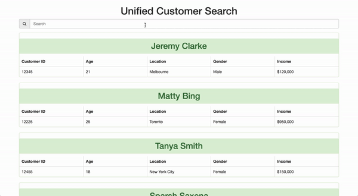
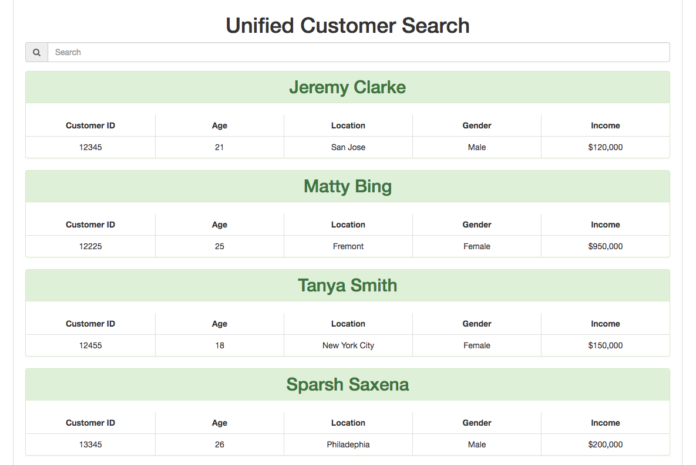
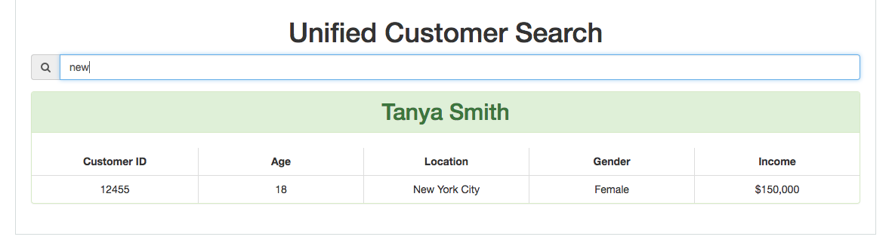

# Unified Customer Search

Complete the given Angular application that implements a simple unified search engine capable of searching customer records. Model the implementation after the instructions below. Click any image to expand it in a new window. Click here for a demo.

 

 - Initially, a search bar displays at the top of a list of customer records.
 - Each customer record has the following fields:

1. Customer ID: The customer's ID number.
1. Name: The customer's name.
1. Age: The customer's age.
1. Location: The customer's location.
1. Gender: The customer's gender.
1. Income: The customer's income.
- The application must take input from the search bar and filter the list of customer records in real time so that it only displays records that contain the search term in any field. For example, if the search term is "phil", then records with the name "Philip Anderson" or the location "Philadelphia" should both display in the list of results.

## The application's initial state.

## When we search the word new, the application returns all records for customers that have the word new in any of their respective fields.

